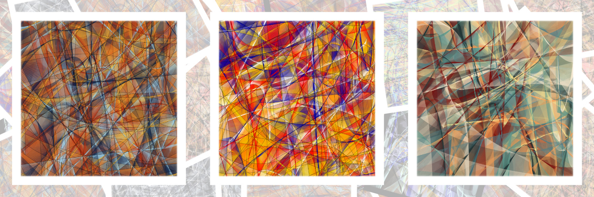
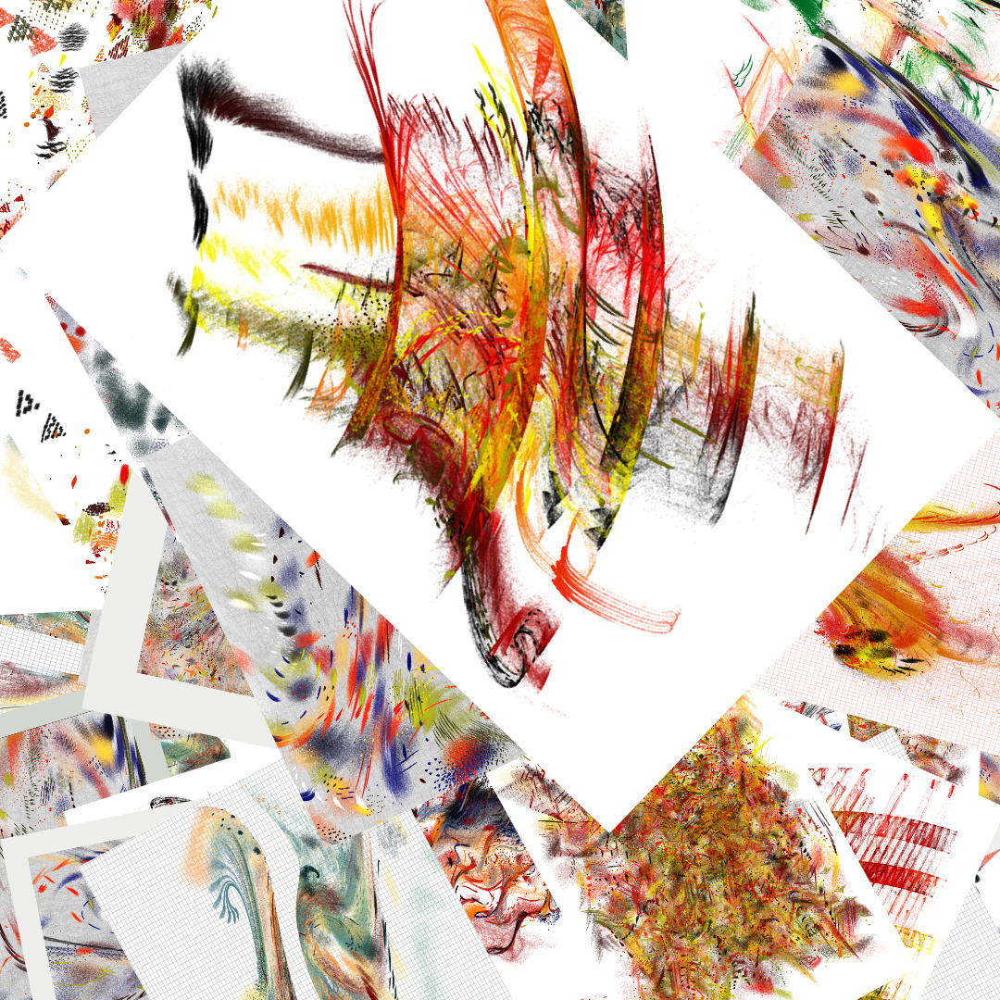
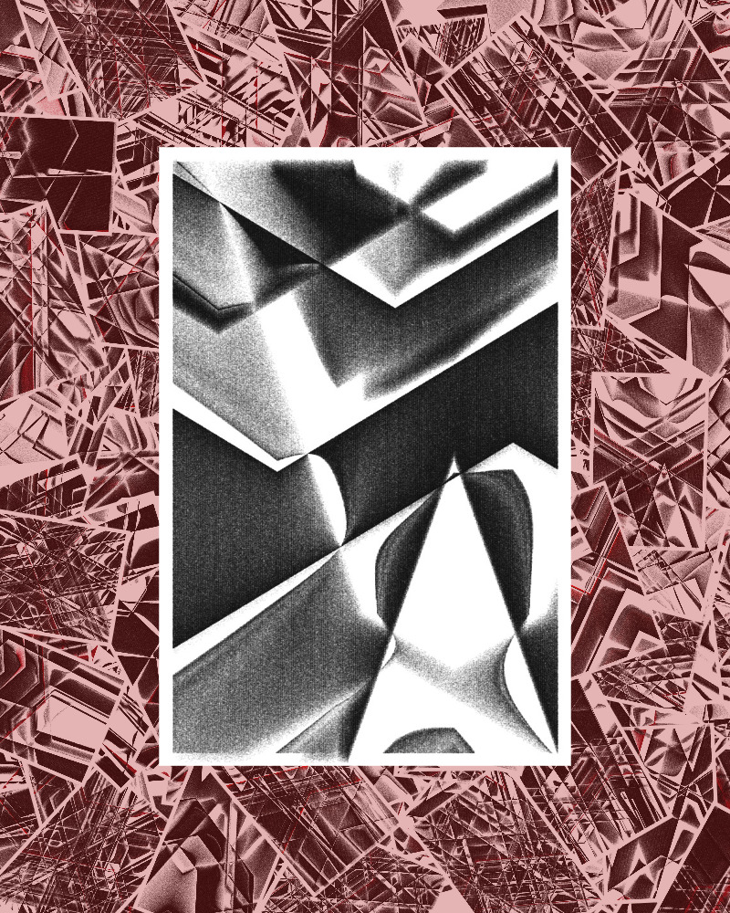
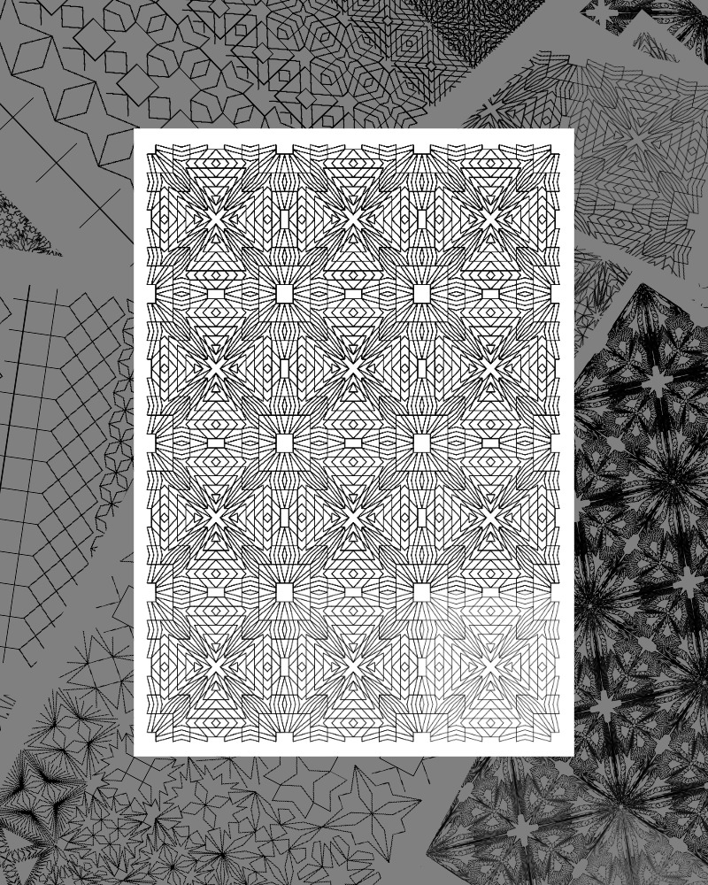
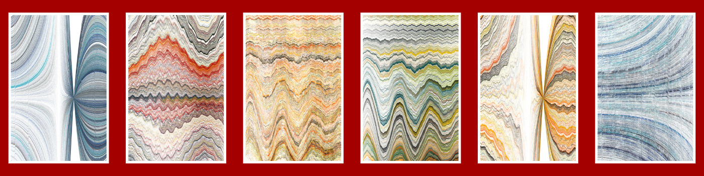
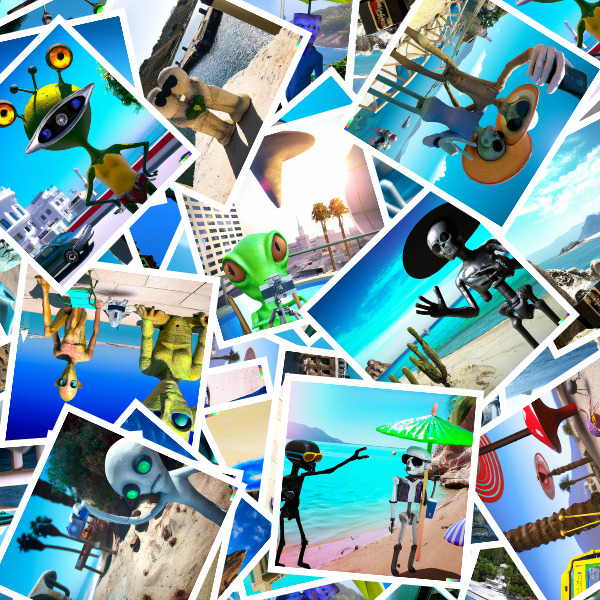

Random Collage Maker
================

Try it out here: [https://josvromans.github.io/imagetools/collage_maker/create](https://josvromans.github.io/imagetools/collage_maker/create)

Select a few images, or an entire directory of images and generate a quick random collage.
The images will be randomly scattered on a canvas with specified dimensions.
Optionally, One or more images can be put in the spotlight on the foreground, and optionally making the background lighter or darker.

# Usecases

- Make a Twitter banner, OpenSea banner (etc..) composed from a set of images. Choose dimensions 1500x500 or 1400x350 respectively. Generate several outputs, and see which one you like the most. (The randomness might surprise you to highlight an image you would not have picked yourself)
See the example above.

- Quickly turn a folder with many outputs into a single image that can showcase the variety, by giving a glimpse of many images.

- Turn the background into the margin around a central image. This can be subtle (color white, alpha 0.9) or pretty wild and using color. And this can even be achieved with a single image (repeated many times on the background).

- Ignore the background and set the alpha value to 1, which means the background iamges will not be visible.
This way you can display an x amount of outputs nicely aligned next to eachother on a selected background color.

- Use images with transparent layers and create interesting results by blending images together.

- Just make a random collage of images scattered all over the canvas

# Controls
Note that unchecking the `Foreground` checkbox will hide that section, which makes it easier to focus on the background first.

### Select images
The usual commands from your operating system apply, for example `ctrl-A` could select all files in a folder.
Using ctrl + click on several specific images or shift+arrows up/down to select consecutive images, etc.

The number of selected images will be displayed, and you can click `Select images` again to add even more images from another directory.
If you want to start over, you can click the `refresh` button.

Click the button `Generate collage` to see what will be generated with the default settings.

### Output 
The goal is to generate a single output file, and you can choose the extension PNG (for highest quality) or JPEG (for smaller filesize), as well as the width and height of the output image. 
The filename can be anything, just note that it will be prefixed with a datetime string to prevent duplicate filenames and to make alphabetical order match creation date. `20230627_174705_filename.jpeg`

### Background
You can scatter smaller images across the canvas by making the scale smaller. 
Because they will not fill the entire space, you can repeat 10 times or even 100 times without any problem.
If the images do not cover the background canvas, area with this background color are visible.
Note that values for scale increment with 0.1 in the user interface, but you can type any value (`0.335` or `1.59`)

### Foreground 
When checked/selected, the fields become visible. The default amount for `items` is 1: a single image will be nicely centered on top of the random background. 
You can add any number here, and they will be aligned with equal spacing next to eachother.

`Scale` By adjusting the scale you can find the value that fits best for the selected output dimensions. Note that this scale is different from the background image scale, so you can compose the background of small images, and a larger version on the foreground.

`Random Tilt` The random tilt is 0 on default, and means the foreground image has no tilt, but by giving this a slight value of 10 degrees, the output can become a bit more playful. 
This is a random maximum tilt, so every time you generate an output it will be different, and can sometimes be 0.

`Mask Color` / `Mask Alpha` The Mask color and alpha value are put on top of the background, before drawing the foreground. 
When the alpha is 0 there will be no change on the background. When the alpha value is 1, the background images will be completely overriden by the specified color. 
For values in between, the background will become lighter or darker, giving the foreground more attention.

### Generate
Generate collage button wil just generate the collage in the browser. Note that you can press this button over and over again to generate random variations.
The images are loaded once, after every parameter change, you can press this button a few times to see some results.

### Save Output
By hitting `Save output` the current output will be saved (with the specified dimension and extension).

When hitting `Save 5 outputs` 5 different and random outputs will be generated automatically. You can change this number to anything and generate 100 variations if you wish.

# Improvements
Issues can be reported, I might accept Pull Requests with improvements. Just note that I keep this lightweight, without using any external libraries.

You are encouraged to make your own fork, or to run the code locally, so you can align the foreground images in any way you want. There might be cases to align them vertically, or in a grid, but I chose to keep the options somewhat limited 
