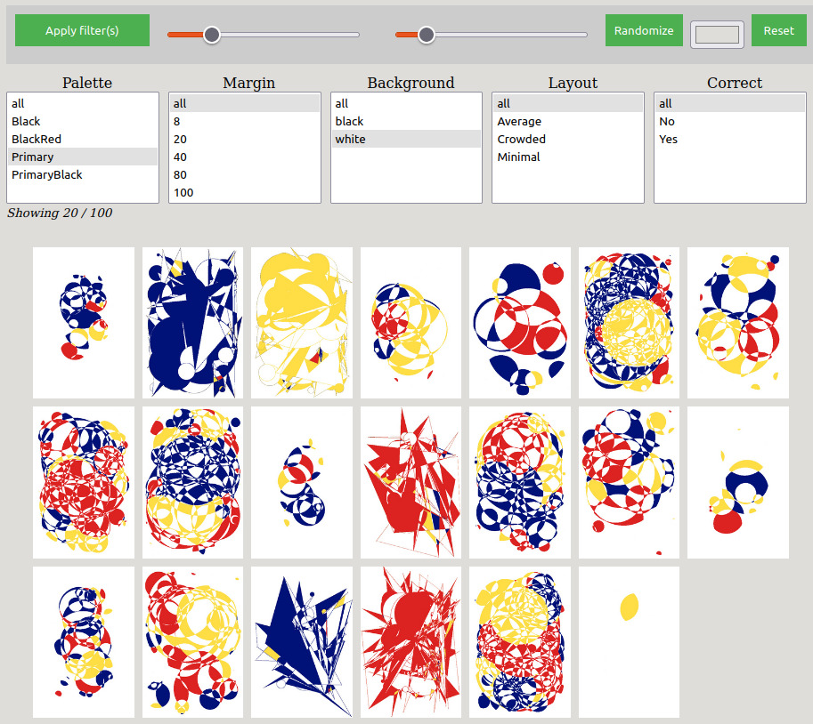

Test it here:
[https://josvromans.github.io/imagetools/image_gallery/filter](https://josvromans.github.io/imagetools/image_gallery/filter)

Display images in a grid, and when parameters are correctly encoded in the filename, you can filter on the properties you defined.
Sliders can scale the images, making them larger or smaller, and also add spacing between images in the grid.
The background color can be set with a color picker.
The randomize button will just shuffle the order of image elements on the html page.

You can use the images in the folder 'example_images_with_properties_in_filename' to load 100 test images in the same format. In the screenshot below, those are filtered and show only one specific palette on the white background (as selected).

(these images have been generated with the 'capture_canvas' tool, also in this repository)

For now, this only works well when:
- Images are all of the same dimensions / aspect ratio
- filename parameters are defined by double underscores. The filename will be split by '__'. The first part will be ignored, it can be a timestamp, any name you have given, a hash, etc.
- After that first part that will be ignored, each feature will be determined in pairs of key & value. There can be as many pairs as you like, but it has only been tested for 5 features. When it is a lot more, the html layout probably needs some fixes.

- example file name that will be handled correctly:
20231101_2112_23566__Palette__Black__Margin__8__Background__white.jpeg
  3 features will be determined (Palette, Margin and Background).  And when you have a lot of images with those same features, you can filter them.

  If you want to use another separator than '__', you can add '&separator=__custom__' to the url

  Note:
  - using dots in the filename can mess things up (everyting after '.' will be ignored)
  - integers will be handled in the code, and sorted numerically, all other things will be sorted alphabetically
 
  This has yet to be tested and improved, and will get a better README eventualyl. For now just these notes.
